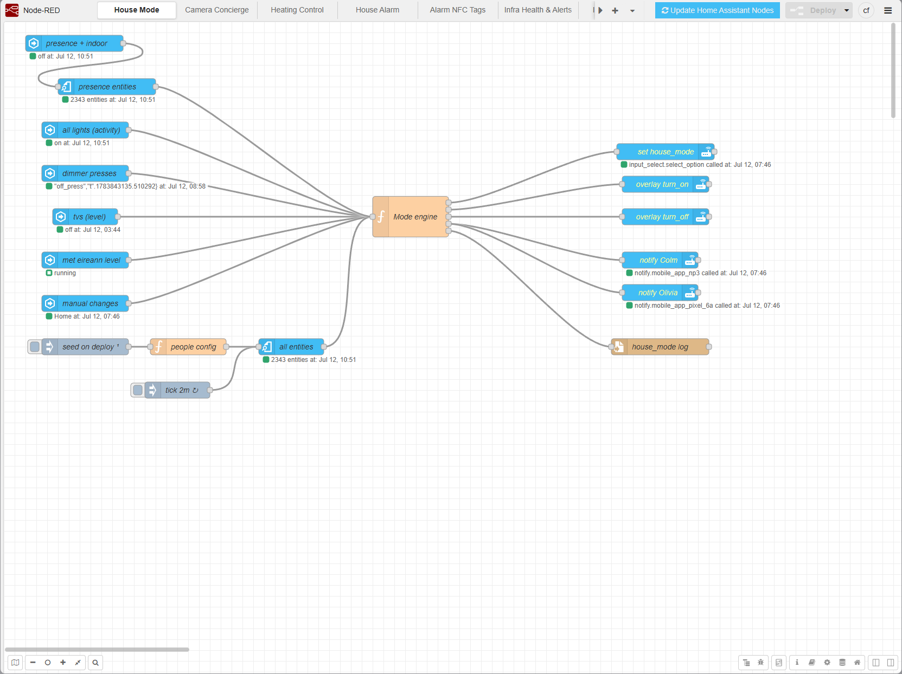
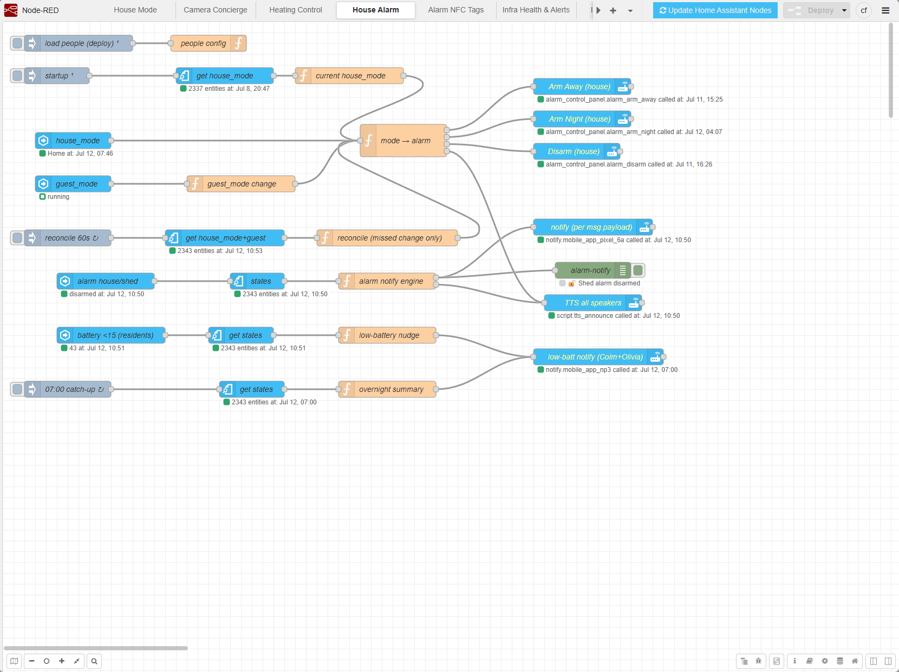
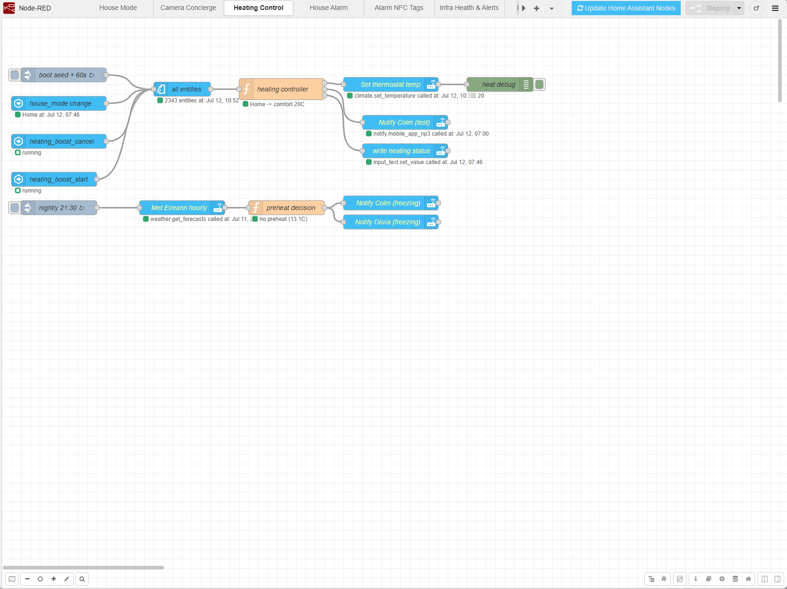
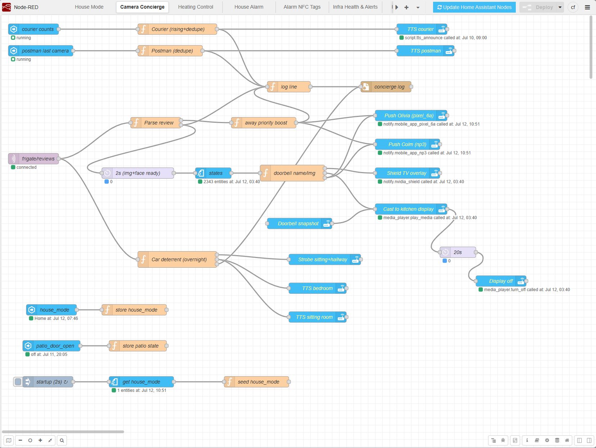

<div align="center">

# 🔴 Node-RED — Smart Home Flows

[](https://nodered.org/)
[](https://www.home-assistant.io/)
[](data/flows.json)
[](LICENSE)
[](https://github.com/colfin22/node-red-config)

*The automation brain behind a family smart home in Ireland.*

</div>

---

The Node-RED flows + config behind the automations in [colfin22/ha-config](https://github.com/colfin22/ha-config). Home Assistant handles the simple, single-trigger stuff; the multi-input, **stateful** logic lives here — deciding the house's mode, arming the alarm, making heating calls from presence + forecast + tariff, and turning camera detections into one smart notification. Runs in Docker in a Proxmox LXC (also backed up nightly by PBS); this repo adds flow versioning + quick recovery.

**Seven flows, each documented below with a screenshot:** House Mode · House &amp; Shed Alarm · Alarm NFC Tags · Camera Concierge · Heating Control · Infra Watchdog · Infra Health &amp; Alerts.

## Tracked
- `docker-compose.yml` — container definition
- `data/flows.json` — flows: House Mode, House Alarm, Alarm NFC Tags, Camera Concierge, Infra Watchdog, Infra Health & Alerts, Heating Control
- `data/settings.js` — config; editor adminAuth reads its credentials from the gitignored `.env`
- `data/package.json` + `data/package-lock.json` — installed palette (reinstalls on first start)
- `git-backup.sh` — the daily backup script

## NOT tracked (re-enter on restore — simple re-entry)
- `data/flows_cred.json` (encrypted credentials) + `data/.config.runtime.json` (their decrypt secret)
- On restore, re-add two secrets in the editor: the **Home Assistant** long-lived token on the `ha-server` config node, and the **MQTT** password on the `mqtt-frigate` broker node.
- `.env` (gitignored) — recreate it next to `docker-compose.yml` before starting:
  ```
  PVE_API_TOKEN=PVEAPIToken=<user>@pve!<tokenid>=<secret>   # read-only audit token for the backup watchdog
  NABU_URL=https://<your-id>.ui.nabu.casa                   # remote base URL for notification images
  NR_ADMIN_USER=<editor username>
  NR_ADMIN_HASH=<bcrypt hash, with every $ escaped as $$>    # editor login (adminAuth reads these from the environment)
  ```

## Want one of these flows? (per-tab exports)
The `flows/` directory holds an **importable JSON per tab**, regenerated automatically on
every nightly backup — grab a file and paste it into Node-RED via **Menu → Import**. Each
file includes the config nodes its flow references (a Home Assistant server node, and the
MQTT broker for the camera flow) — after importing, point those at your own HA/MQTT and add
your credentials; they are exported without secrets. Entity ids, camera names and notify
targets are this house's — expect to search-and-replace.

## Restore
1. PBS-restore or rebuild the LXC (Debian + Docker + compose).
2. `git clone https://github.com/colfin22/node-red-config.git /opt/node-red` (or via the repo's SSH deploy-key alias)
3. Recreate `.env` (see above), then `cd /opt/node-red && docker compose up -d`
4. Open the editor, re-enter the HA token (`ha-server`) + MQTT password (`mqtt-frigate`), Deploy.

## Auto-backup
`node-red-backup.timer` (systemd) runs `git-backup.sh` daily at 02:30 — regenerates `flows/`, then commits + pushes if anything changed. The repo is public, so the script **refuses to push and raises an alert** if anything committed matches a secret pattern (API tokens, bcrypt hashes, JWTs, private keys, remote-access URLs).

---

# House Mode — how it works



The **House Mode** tab (`tab-hm`) is the household state orchestrator. It computes and maintains `input_select.house_mode` — the single source of truth that other flows (alarm, heating and infrastructure alerts) consume so each doesn't have to do its own presence tracking.

## Three states + overlays

- **Home** — at least one resident is in (or just arrived).
- **Away** — all residents out, confirmed by a 20-minute quiet period (see below).
- **Sleeping** — everyone in bed; auto-detected overnight.
- **Overlays** (independent of the above): `storm_mode` (auto from Met Éireann warnings), `maintenance_mode` (blocks Away, silences all infra alerting while planned maintenance is under way, auto-expires after 4 hours). `guest_mode` exists as a helper but is intentionally ignored by the engine — it is consumed directly by other automations.

## Away detection
All residents out → 20-minute timer → `Away`. At the fire point the engine checks the indoor sensors (sitting-room mmWave, office, landing, hallway) for motion in the last 15 minutes — if anyone is still moving around, it holds off and retries every 20 minutes. `maintenance_mode` also blocks the transition. Anyone arriving during the countdown cancels it immediately.

**Dead/low-phone safeguards** live here: if a resident's phone is off Wi-Fi and its battery sensor is unavailable (genuinely dead/off), the engine treats that person as *unconfirmed-away* and won't set Away — it pushes a notification instead. A low-but-alive phone still reports location and is trusted. A nudge fires when a phone drops below 15 % so presence keeps working. These alerts go to Colm and Olivia only.

## Sleeping detection (auto, 22:00–07:00)
Requires: mode is `Home`, a resident is home, `maintenance_mode` off, and no activity for 20 minutes — where activity means any of the 25 tracked lights, either TV, any dimmer press, or any indoor sensor. A 2-hour re-entry block prevents flipping back to Sleeping straight after waking. Nothing wakes before 06:00; first activity from 06:00 returns to Home.

## People config (`hm-cfg` node)
Residents (Colm, Olivia) enable Sleeping and trigger Away. Guests (Daire) only contribute to `anyoneHome()` — they prevent Away when physically present but don't enable Sleeping. Cian (no phone, 12) is excluded from both; indoor sensors are his safety net.

### Implementation notes
- All Away evaluations use a fresh live HA snapshot via `ha-get-entities` — no stale flow context.
- `server-state-changed` nodes always use `outputInitially: false`; startup state is seeded via an inject → `ha-get-entities` → function chain (global context is not populated reliably at 1 s after start).
- On every state change: sets `input_select.house_mode` via `hm-set-mode`, logs to `/data/house_mode.log` with IST timestamp + reason, pushes a notification to Colm.

---

# House & Shed Alarm — how it works



Two tabs automate the **Alarmo** alarm — `alarm_control_panel.house` and `.shed` (two independent panels); none needs a code. The **house** alarm is driven by House Mode state; the **shed** is NFC-driven. All notifications and voice announcements are **state-driven**, so they fire however the alarm changes — phone, Alarmo card, NFC, or automatic.

> Node-RED signs in to Home Assistant as its own dedicated **"Node-RED" user**, so Alarmo's activity log attributes automatic arm/disarm to *Node-RED* instead of a person. Manual arm/disarm still shows whoever did it.

## House — auto arm/disarm via House Mode (tab `House Alarm`)
The alarm follows `input_select.house_mode` directly:

- **Away** → `alarm_arm_away` (house)
- **Sleeping** → `alarm_arm_night` (house) — silent, no announcement; people are in bed
- **Home** → `alarm_disarm` (house) + spoken "Welcome home" announcement *only* when returning from Away (not from Sleeping)

All presence tracking, timing, dead-phone safeguards, and battery nudges live in the **House Mode** tab — the alarm tab just reacts to the resulting state. On Node-RED restart, a startup inject reads the current `house_mode` and `guest_mode` via `ha-get-entities` and syncs both into flow context before the first evaluation.

Two robustness details: a **60-second reconcile** compares the live `house_mode` against the last mode the flow processed and re-applies any change missed during a websocket drop (a manual disarm is respected — it only reacts to *missed mode changes*, never to alarm state). And every arm/disarm call is **idempotent** — if the panel is already in the target state the call is skipped, so nothing spams the Alarmo log with "cannot go to state X from X".

## Guest mode
When `input_boolean.guest_mode` is on, only **Away** arming is suspended (guests moving around would trip an away-armed alarm):
- House mode going **Away** → alarm stays as-is (arm away skipped silently)
- House mode going **Sleeping** → **still arms night** — guest mode does NOT block night arming (changed 02-07-2026), so the perimeter stays armed overnight with guests in
- **Home always disarms** regardless of guest mode

When guest mode is turned **off**, the flow immediately re-evaluates the current house mode and arms accordingly — if the house is already Away it arms away, if Sleeping it arms night, if Home it does nothing.

## Alarm notifications + voice (same tab)
Derived from the state of `.house` + `.shed` (Alarmo's own events are internal, not on the HA bus). Five events → **push to all people + a spoken announcement** on the home audio group: **armed · disarmed · triggered · no-longer-triggered · failed-to-arm.** Trigger/failure messages carry the cause (open sensors). A visitor is only pushed while at home.

## Ways to disarm the house
1. **House Mode → Home** — automatic on resident arrival (handled by House Mode tab).
2. **Front-door NFC tag** — instant and deterministic.
3. **Manual** — the Alarmo app or panel.
4. **Touchpad** *(planned)* — a physical keypad for the one case software can't cover: a fully-dead phone on arrival.

## Shed + NFC tags (tab `Alarm NFC Tags`)
- Listens for the HA `tag_scanned` event.
- **Front-door tag** → disarm the house (no-op if already disarmed).
- **Back-door tag** → disarm the shed for up to **2 hours**. It re-arms when **either** the shed door has been **closed for 15 minutes** (after being opened) **or** the **2-hour cap** is reached *with the door closed* (watching `binary_sensor.shed_door_contact`).
- **Shed left open at the 2-hour cap** → it does **not** arm; instead it **notifies everyone + announces** that the shed has been left open and unarmed, then waits to re-arm when the door is finally closed for 15 minutes.
- **Nightly 22:00 auto-arm** → arms the shed only if it is currently disarmed and the door is closed — a catch-all for a shed left disarmed during the day.

## Strobe (HA, not Node-RED)
Two separate HA automations — one on `alarm_control_panel.house`, one on `.shed` — trigger on each panel's `triggered` state and run `script.strobe_lights` on `light.downstairs` until that panel is disarmed. A siren is planned.

### Implementation notes
- `server-state-changed` triggers use an **explicit entity list** — the `substring`/`regex` filter throws `a?.some is not a function` on this palette version.
- All `api-call-service` nodes use the `action` property — the old separate `domain`/`service` fields are deprecated in v1.0 of the palette. **Static calls:** set `action: 'domain.service'`. **Dynamic calls** (action from message): set `action: '{{payload.action}}'` (mustache). Do not use `actionType`/`dataType` — the palette ignores them; the only way `isDynamicValue()` returns true is mustache or a Node-RED env var.
- Notify dispatch uses the `action` form (`{action:'notify.x', data:…}`); the `people config` node publishes to **`global` context** so both alarm tabs share one source of truth.
- TTS for alarm state changes is centralised in the notification engine (one announce per event, any source); the NFC shed-open alert announces from the NFC tab as it is not an alarm state change.

---

# Heating Control — how it works



Runs off House Mode + time of day, driving the **local HomeKit** thermostat (`climate.netatmo_smart_thermostat`). The Netatmo holds a flat **eco 18.5°C** baseline; this flow only ever *raises* above it and re-asserts the target every 30 minutes so a manual override never lapses back to the baseline.

## Temperatures
eco 18.5 · night 19.5 · comfort 20 · hot 20.5 · frost 12

## Schedule (House Mode + time)
- **Home** → comfort 20; **hot 20.5** between 19:00–22:00
- **Sleeping** → night 19.5 overnight; comfort 20 from **07:00**
- **Away** → eco 18.5; drops to frost 12 after 24 h empty (gated by the `Away 24h+` dashboard toggle, `input_boolean.heating_extended_away`)

## Forecast pre-heat
Nightly at **21:30** it reads the Met Éireann hourly forecast for tomorrow's 05:00–07:00 low and starts the 07:00 warm-up **earlier** — the colder it is, the earlier: 4–8°C → 15 min, 0–4°C → 30 min, −3–0°C → 45 min, below −3°C → 60 min. A phone push to Colm + Olivia the night before, **only when the low is sub-zero**.

## Proximity pre-heat
When the house is empty and someone is driving home (within 10 km and getting closer, via the Proximity integration), it warms toward comfort so it's ready on arrival. The pre-heat **latches** once triggered — a GPS wobble flipping "towards" to "away from" for a moment can't bounce the setpoint mid-approach; it releases only when they arrive (house leaves Away) or genuinely leave the area again (beyond 12 km).

## Boost
Boost from the **dashboard** (pick a temperature, tap Boost) or by nudging the thermostat **above** the scheduled target — either way it holds for **2 hours** before the schedule resumes, and re-boosting restarts the clock. Turning the thermostat down to or below the schedule (or tapping Cancel on the dashboard) **cancels** the boost — a turn-down is never treated as a "boost" (this also absorbs the Netatmo app's boost-delete, which reverts the device to its 18.5 baseline). A boost cancels the moment everyone leaves, and can't start while the house is Away. The controller writes its current state ("Boost 22° until 15:30" / "Home: comfort 20°") to `input_text.heating_status` for the dashboard.

## Guest mode
While `input_boolean.guest_mode` is on the heating never drops to the Away setback (visitors stay warm); the normal overnight and morning behaviour still applies.

### Implementation notes
- Tab `Heating Control`; controller `heat-fn`, fed by `heat-get` — an **`ha-get-entities` version 3** node. **A version-1 node returns an empty list**, which silently broke this flow (it fell back to "Home" and never saw Away) until fixed 02-07-2026. When adding a get-entities node, clone a v3 one.
- Triggers: `input_select.house_mode` change + a **60 s heartbeat**; output de-duped with a **30-min re-assert**.
- Forecast sub-flow: `heat-fc-cron` (21:30) → `heat-fc-get` (`weather.get_forecasts`, hourly, `weather.forecast_home`; response via `outputProperties` valueType `results`) → `heat-fc-fn` → notify (sub-zero only). The pre-heat decision lives in `flow.preHeat` (in-memory → lost on a restart between 21:30 and morning, fails safe to the normal 07:00).
- Boost detection is poll-lag-proof: a manual setpoint is only treated as a boost once the flow's own last write has been confirmed by the thermostat.

# Camera Concierge — how it works



The **Camera Concierge** (tab `Camera Concierge`) is the sole handler of Frigate camera notifications. It turns Frigate detections into smart, consolidated phone alerts. It replaced six separate HA automations and the old package concierge.

## Signal it listens to
- **Primary:** MQTT topic **`frigate/reviews`** (broker `10.0.0.229`). Frigate only publishes a review at **`severity: alert`** when an object enters an alert zone — so masks/zones (e.g. the driveway car-mask) are honoured upstream, and the concierge only acts on real, zone-qualified events.
- **Secondary branches:** HA websocket for the courier count sensors + the postman sensor, and the patio-door switch state.

## Turning a detection into a notification
For each `frigate/reviews` message the flow decides three things:

1. **Relevant?** Only `severity: alert`. Rear cameras are **dropped entirely while the patio-door NFC switch is on** (`input_boolean.patio_door_open`).
2. **Kind** (first match, in order): **Person → Vehicle** (car/truck) **→ Motorcycle → Bicycle → Package → Umbrella** — the six Frigate alert labels. Each kind is tracked separately.
3. **Zone:** **Front** (`Front_Car` + `Front_Van`), **Doorbell** (on its own), or **Rear** (`Rear_Door` + `Rear_Shed`).

Each unique **(zone + kind)** opens an "incident" (120-second window). So a person out front *and* at the doorbell = two notifications ("Person — Front", "Person — Doorbell"); a person and a vehicle out front = two more.

## The notification — three stages, one notification
All stages share the same notification **tag**, so they update in place rather than stacking:

1. **Immediate text** — fires the instant the review starts, **no image**, so the alert lands without waiting on a download (e.g. "📷 Person — Front").
2. **Snapshot** — a still frame attached as soon as Frigate has it (fast).
3. **GIF** — the animated preview replaces the snapshot when the review ends.

If more cameras in the same zone+kind see it, the notification **updates its camera list** instead of firing new ones.

## Which camera's view you get
Within a zone the snapshot, GIF and tap-link all come from the camera that **detected first** — the one that opened the 120-second incident (shed-first → shed's view, door-first → door's view). The notification text still lists every camera that saw it.

## Tapping the alert
The notification's tap action (`clickAction`/`url`) opens the **event clip** (`clip.mp4`) of that first-detecting camera — straight to the footage.

## Who gets what
- **Phone push** (text → snapshot → GIF) → **both phones**: Colm (`mobile_app_np3`) + Olivia (`mobile_app_pixel_6a`).
- **Doorbell + person** also casts a snapshot to the **kitchen display** (20 s) and an overlay on the **Shield TV**.
- **Couriers** (DPD/GLS/Amazon/UPS/FedEx/DHL/An Post on the front cameras) → spoken **"\<courier\> has landed"** on the home audio group — suppressed when `house_mode = Sleeping`.
- **Postman** at the doorbell → spoken **"the postman has been detected"** — suppressed when `house_mode = Sleeping`.
- The two TTS branches share a 2-minute cooldown so one An Post delivery never announces twice.
- Phone pushes are unaffected by Sleeping — that suppression is speaker-only. When `house_mode = Away`, camera pushes are **escalated**: delivered immediately at high priority on a dedicated high-importance “Cameras Away” channel with a ⚠️ title, so a person at the house while everyone is out cuts through.

## Person-at-the-car deterrent
When `house_mode = Sleeping`, a **person** detected in the front car or van focus zone triggers a deterrent: sitting-room and hallway lights strobe and a warning is announced on the bedroom and sitting-room speakers. A 120-second cooldown prevents repeat triggers from the same event. Tied to Sleeping mode rather than a fixed clock window so it responds to when the household actually goes to bed.

## Anti-spam / suppression
- Rear silenced while the patio-door switch is on.
- Courier/postman TTS silenced when `house_mode = Sleeping` (push still goes to phones).
- Per-incident grouping (multiple cameras = one notification).
- 120 s incident window + courier/postman cooldowns to avoid repeats.

## Behind the scenes
- Every action is logged to `data/camera_concierge.log` (tags `push-grp` / `push-grp-snap` / `push-grp-gif:<cam>`, etc.).
- Whole flow version-controlled in this repo (`colfin22/node-red-config`, nightly git backup); the LXC is also in the PBS nightly backup.

### Implementation notes
- Real Frigate camera names are **title-case**: `Doorbell`, `Front_Van`, `Front_Car`, `Rear_Door`, `Rear_Shed`.
- Notify `data` must be built with explicit JSONata (`{"title":…, "message":…, "data":…}`) — otherwise the nested `data` (image/clickAction) gets flattened.
- `house_mode` is mirrored into flow context (`flow.house_mode`) so the courier/postman TTS suppression and the person-at-the-car deterrent can read it cheaply. A `server-state-changed` watcher updates it on every change (**with `for:0, forType:num` — a missing/empty `for` throws `ConfigError: Invalid config value for 'for'` on every change**), and a startup inject → `ha-get-entities` → function seeds the current mode on restart. The watcher uses `outputInitially:false`, so the **seed is what keeps Sleeping-based behaviour correct after a Node-RED restart mid-Sleeping/Away** — the seed's `ha-get-entities` **must** output to `msg.payload` (`outputLocationType:msg`, not `none`) or it silently falls back to a default.
- Context keys derived from review ids are sanitised (dots → `_`) because Frigate review ids contain a dot (which Node-RED would otherwise treat as a nested-context path).

# Infra Watchdog — how it works

**Uptime Kuma** posts every monitor up/down event to a webhook in this tab (`/uk-event`). The watchdog turns those raw events into escalating alerts rather than one-ping-per-flap:

- **Tier 1** — phone push on first confirmed down.
- **Tier 2** — still down after the escalation window → repeat push **+ a spoken announcement** (voice only while someone is home).
- **Tier 3** — long outages re-alert on a slow repeat so a dead service can't be silently forgotten.
- Recovery sends an "up again" push and resets the monitor's state machine.
- **Quiet hours (22:00–07:00)** hold non-urgent noise; anything still outstanding is delivered in an **07:00 overnight summary**.
- While `maintenance_mode` is on, notifications are suppressed but the state machines keep running — anything still down when maintenance ends re-alerts on its next repeat.

Uptime Kuma stays the source of truth for *reachability*; the flow below handles *health*.

# Infra Health & Alerts — how it works

One tab consolidates what used to be eleven separate HA infrastructure-alert automations. Every alert is titled **`[Category] Subsystem: detail`** (categories: Health / Backup / Monitoring / Service) and lands on a phone with a matching Android notification channel + group, plus a line in a log file.

**Inputs:**
- **Sensor-driven rules** — a `server-state-changed` watcher over ~40 entities feeds a rule engine (disk usage, pool health, service states, rsync failures…) with per-rule thresholds, sustain times and de-duplication.
- **Webhooks** — backup scripts (TrueNAS config, MikroTik config, restic) and Zabbix post their outcomes straight to HTTP-in endpoints here.
- **Backup watchdog** — each morning it queries the Proxmox API on both nodes for last night's vzdump task list and alerts **only on failures** (the read-only API token comes from the gitignored `.env`).
- **Data-freshness checks** — e.g. an hourly check that the ESB Networks smart-meter add-on has polled recently; a stale poll timestamp means the add-on is wedged even though its sensors still show plausible values.

**Delivery:** shared quiet-hours gate — alerts between 22:00 and 07:00 are held and flushed at 07:00 with their original trigger time in the title; `maintenance_mode` drops alerts entirely (logged, not pushed) while planned work is under way.

## Licence
Built by Colm Finn — [MIT licensed](LICENSE).
