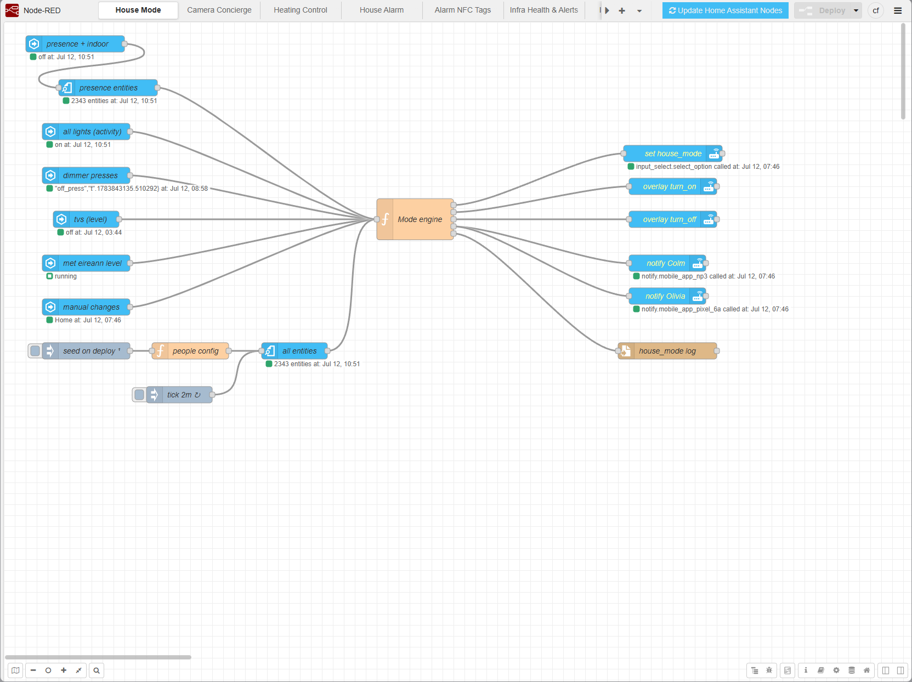
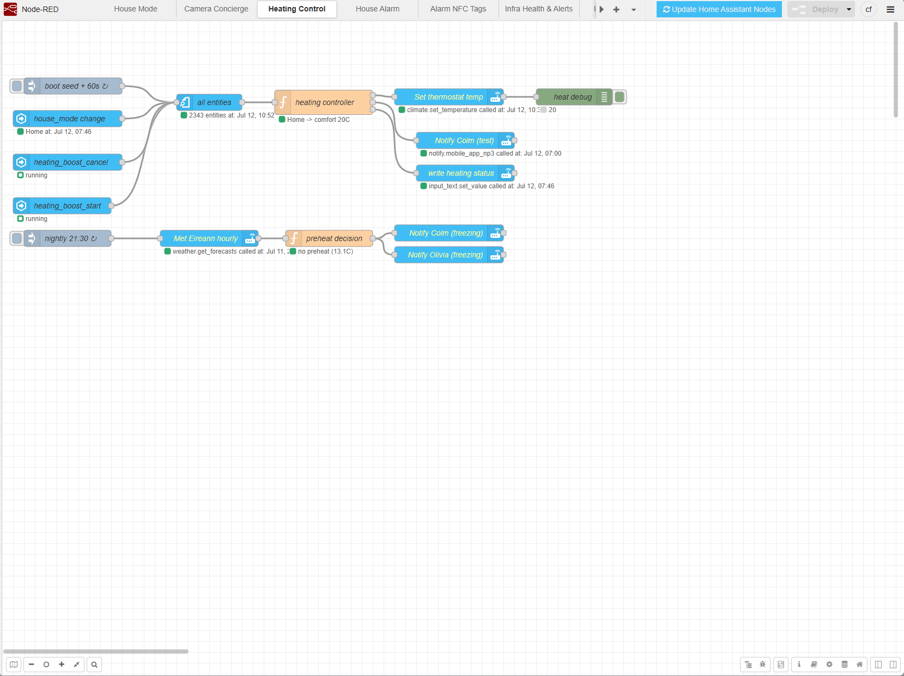
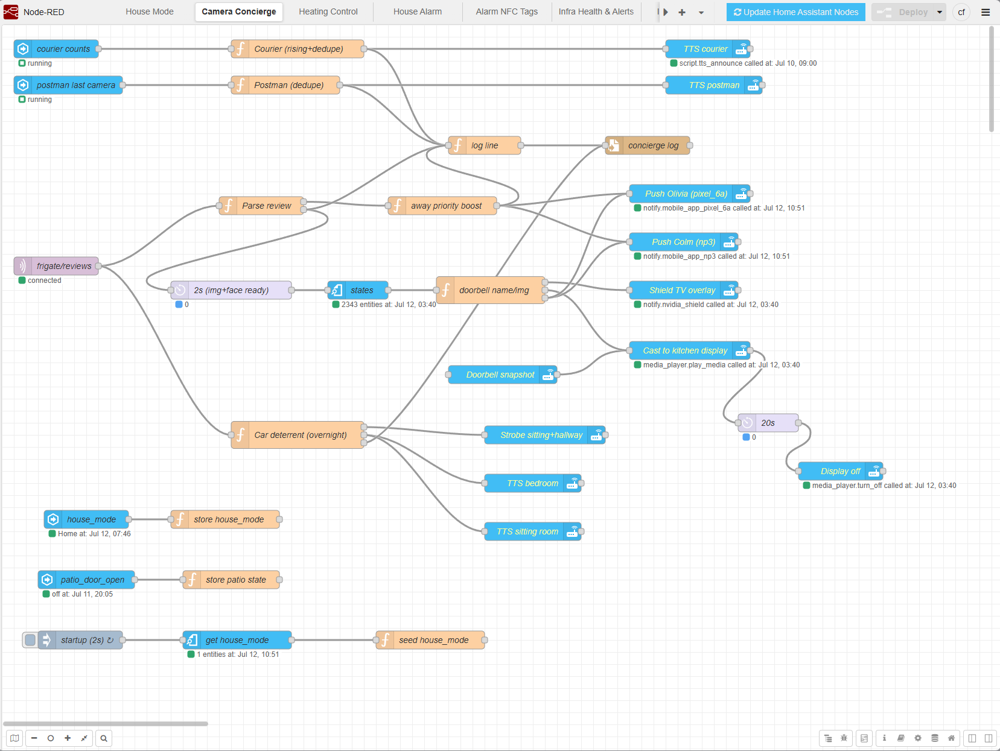

# 🔴 Node-RED — Smart Home Flows

*The automation brain behind a family smart home in Ireland.*

---

The Node-RED flows + config behind the automations in [colfin22/ha-config](https://github.com/colfin22/ha-config). Home Assistant handles the simple, single-trigger stuff; the multi-input, **stateful** logic lives here — deciding the house's mode, arming the alarm, making heating calls from presence + forecast + tariff, and turning camera detections into one smart notification. Runs in Docker alongside Home Assistant; this repo adds flow versioning and quick recovery.

**Seven flows, each documented below with a screenshot:** House Mode · House &amp; Shed Alarm · Alarm NFC Tags · Camera Concierge · Heating Control · Infra Watchdog · Infra Health &amp; Alerts.

## Start here if you only want one flow

Most visitors want a single flow, not this whole setup. Nothing below assumes you run anything the
way I do.

1. **Grab the tab you want** from the [`flows/`](flows/) directory. Each file is an importable
   JSON for one tab, regenerated automatically on every nightly backup.
2. **Import it** into your own Node-RED via **Menu → Import**. Each file already includes the
   config nodes its flow references (a Home Assistant server node, and the MQTT broker for the
   camera flow). They are exported without secrets.
3. **Point the config nodes at your own setup.** Double-click any Home Assistant node, edit the
   server, and fill in your Base URL (with the scheme and port, e.g. `http://192.168.1.10:8123`)
   and a Long-Lived Access Token. Same for the MQTT broker on the camera flow.
4. **Set the environment variables the flow needs** (next section).
5. **Replace the entity ids that are still mine** (the table after that).

## Configuration lives in environment variables

Anything specific to a household — who lives there, which phones to notify, which server to poll —
is read from environment variables rather than written into the flows. Copy
[`.env.example`](.env.example), which documents every variable, and fill in your own values.

**Setting them when you imported a single tab:** there is no `docker-compose.yml` in play, so `.env`
does not apply. Set them in the editor instead: double-click the flow tab's name, then the
**Environment Variables** tab. That needs Node-RED 2.1 or newer.

**People** are numbered slots, and the same slot is used by every flow:

| Variable | Example | Meaning |
|---|---|---|
| `PERSON_1_NAME` | `Alice` | Display name, used in spoken and pushed messages |
| `PERSON_1_ENTITY` | `person.alice` | Their HA person entity |
| `PERSON_1_PING` | `binary_sensor.alice_phone` | Optional second presence signal, OR'd with the person entity |
| `PERSON_1_NOTIFY` | `notify.mobile_app_alice` | Where their push notifications go |
| `PERSON_1_ROLE` | `resident` | `resident` counts towards the house being empty; `guest` never does |
| `PERSON_1_ONLY_WHEN_HOME` | `true` | Optional. Only notify this person while they are at home |
| `PERSON_1_BATTERY` | `sensor.alice_phone_battery_level` | Optional. Enables their low-battery alerts |
| `PERSON_1_HA_USER_ID` | `da119…` | Optional. Attributes "who changed the heating" and who scanned an NFC tag |

Add people by filling `PERSON_2_*`, `PERSON_3_*` and so on — up to eight slots are read, and empty
slots are skipped. **One exception needs an edit rather than a variable:** the House Mode presence
node watches slots 1 to 3 explicitly, so if you have more than three tracked people, add
`${PERSON_4_ENTITY}` and `${PERSON_4_PING}` to its entity list.

If no person resolves, the people-config nodes log a warning and keep whatever they had rather than
treating the house as empty — so a typo degrades loudly instead of arming the alarm on you.

### What to search and replace

Every id below is mine and will not exist on your system. Nothing errors when a name does not
match, the branch just silently never fires, so work through the list rather than waiting for
an error to tell you.

| What | Mine | Where |
|---|---|---|
| Camera names | `Doorbell`, `Front_Car`, `Front_Van`, `Rear_Door`, `Rear_Shed` | Camera Concierge. **Must match your Frigate config exactly, capitals and all** |
| House mode | `input_select.house_mode` | Every flow. This is the orchestrator, it drives most of the logic |
| Maintenance switch | `input_boolean.maintenance_mode` | Both infra flows — suppresses alerts during planned work |
| Patio door switch | `input_boolean.patio_door_open` | Camera Concierge (silences the rear cameras) |
| Front door contact | `binary_sensor.front_door_contact` | Camera Concierge (silences the doorbell popup and the doorbell pushes on the way out) |
| Speakers and displays | `media_player.kitchen_display_cast`, `media_player.sitting_room_speaker_cast`, `notify.nvidia_shield` | Camera Concierge TTS, alarm voice |
| Bedroom speaker | `media_player.*_bedroom_speaker_cast` | Person-at-the-car deterrent |
| Lights | `light.hallway`, `light.sitting_room`, and the per-room lights in the House Mode activity watcher | Camera Concierge deterrent, alarm strobe, House Mode activity |
| Motion and presence | `binary_sensor.hallway_motion_sensor_occupancy` and the other three indoor sensors | House Mode — these are what "activity" means |
| Courier counters | `sensor.front_car_<courier>_count`, `sensor.front_van_<courier>_count` | Camera Concierge courier TTS |
| TVs | `binary_sensor.lg_tv_online`, `binary_sensor.samsung_tv_online` | House Mode quiet detection |
| Weather warnings | `sensor.met_eireann_warning_level` | House Mode storm overlay (Irish-specific) |
| Infrastructure sensors | the `sensor.proxmox_*`, `sensor.proxmox2_*` and `sensor.truenas_*` families | Infra Health & Alerts rule engine |

---

# House Mode — how it works

The **House Mode** tab (`tab-hm`) is the household state orchestrator. It computes and maintains `input_select.house_mode` — the single source of truth that other flows (alarm, heating and infrastructure alerts) consume so each doesn't have to do its own presence tracking.

## Three states + overlays

- **Home** — at least one resident is in (or just arrived).
- **Away** — all residents out, confirmed by a 20-minute quiet period (see below).
- **Sleeping** — everyone in bed; auto-detected overnight.
- **Overlays** (independent of the above): `storm_mode` (auto from Met Éireann warnings), `maintenance_mode` (blocks Away, silences all infra alerting while planned maintenance is under way, auto-expires after 4 hours). `guest_mode` exists as a helper but is intentionally ignored by the engine — it is consumed directly by other automations.

## Away detection
All residents out → 20-minute timer → `Away`. At the fire point the engine checks the indoor sensors (sitting-room mmWave, office, landing, hallway) for motion in the last 15 minutes — if anyone is still moving around, it holds off and retries every 20 minutes. `maintenance_mode` also blocks the transition. Anyone arriving during the countdown cancels it immediately.

**Dead/low-phone safeguards** live here: if a resident's phone is off Wi-Fi and its battery sensor is unavailable (genuinely dead/off), the engine treats that person as *unconfirmed-away* and won't set Away — it pushes a notification instead. A low-but-alive phone still reports location and is trusted. A nudge fires when a phone drops below 15 % so presence keeps working. These alerts go to the residents only.

## Sleeping detection (auto, 22:00–07:00)
Requires: mode is `Home`, a resident is home, `maintenance_mode` off, and no activity for 20 minutes — where activity means any of the 25 tracked lights, either TV, any dimmer press, or any indoor sensor. A 2-hour re-entry block prevents flipping back to Sleeping straight after waking. Nothing wakes before 06:00; first activity from 06:00 returns to Home.

## People config (`hm-cfg` node)
Residents (`PERSON_n_ROLE=resident`) enable Sleeping and trigger Away. Guests (`PERSON_n_ROLE=guest`) only contribute to `anyoneHome()` — they prevent Away when physically present but don't enable Sleeping. Anyone in the house with no tracked phone is excluded from both, and the indoor sensors are their safety net.

### Implementation notes
- All Away evaluations use a fresh live HA snapshot via `ha-get-entities` — no stale flow context.
- `server-state-changed` nodes always use `outputInitially: false`; startup state is seeded via an inject → `ha-get-entities` → function chain (global context is not populated reliably at 1 s after start).
- On every state change: sets `input_select.house_mode` via `hm-set-mode`, logs to `/data/house_mode.log` with a local timestamp + reason, pushes a notification, and publishes the **same reason** to `input_text.house_mode_reason` (`hm-reason`).
- **Why the reason is published, not just notified:** the engine always knew *why* it changed mode — `morning activity (light.sitting_room)`, `resident returned`, `all residents left (20m)`, `quiet 20m, no activity` — but that string only ever reached a push notification. Other flows (the heating controller, below) can now name the actual cause instead of guessing at it. A **manual** mode change publishes `changed by hand`, so a consumer can't attribute it to whatever the engine last decided.

---

# House & Shed Alarm — how it works

Two tabs automate the **Alarmo** alarm — `alarm_control_panel.house` and `.shed` (two independent panels); none needs a code. The **house** alarm is driven by House Mode state; the **shed** is NFC-driven. All notifications and voice announcements are **state-driven**, so they fire however the alarm changes — phone, Alarmo card, NFC, or automatic.

> Node-RED signs in to Home Assistant as its own dedicated **"Node-RED" user**, so Alarmo's activity log attributes automatic arm/disarm to *Node-RED* instead of a person. Manual arm/disarm still shows whoever did it.

## House — auto arm/disarm via House Mode (tab `House Alarm`)
The alarm follows `input_select.house_mode` directly:

- **Away** → `alarm_arm_away` (house)
- **Sleeping** → `alarm_arm_night` (house) — silent, no announcement; people are in bed
- **Home** → `alarm_disarm` (house). When returning **from Away** the spoken welcome is not fired on arrival — it is **held until the front door opens** (then a short delay), so you are inside to hear it, then a single merged line **names whoever is back**: *"Welcome home, [name]. The house has been disarmed."* on the home audio group. It stays silent if the door never opens within a few minutes, and says nothing when Home comes from Sleeping. (Someone whose phone never leaves the house can't flip Away→Home, so is never named.)

All presence tracking, timing, dead-phone safeguards, and battery nudges live in the **House Mode** tab — the alarm tab just reacts to the resulting state. On Node-RED restart, a startup inject reads the current `house_mode` and `guest_mode` via `ha-get-entities` and syncs both into flow context before the first evaluation.

Two robustness details: a **60-second reconcile** compares the live `house_mode` against the last mode the flow processed and re-applies any change missed during a websocket drop (a manual disarm is respected — it only reacts to *missed mode changes*, never to alarm state). And every arm/disarm call is **idempotent** — if the panel is already in the target state the call is skipped, so nothing spams the Alarmo log with "cannot go to state X from X".

## Guest mode
When `input_boolean.guest_mode` is on, only **Away** arming is suspended (guests moving around would trip an away-armed alarm):
- House mode going **Away** → alarm stays as-is (arm away skipped silently)
- House mode going **Sleeping** → **still arms night** — guest mode does NOT block night arming (changed 02-07-2026), so the perimeter stays armed overnight with guests in
- **Home always disarms** regardless of guest mode

When guest mode is turned **off**, the flow immediately re-evaluates the current house mode and arms accordingly — if the house is already Away it arms away, if Sleeping it arms night, if Home it does nothing.

## Alarm notifications + voice (same tab)
Derived from the state of `.house` + `.shed` (Alarmo's own events are internal, not on the HA bus). Five events → **push to all people + a spoken announcement** on the home audio group: **armed · disarmed · triggered · no-longer-triggered · failed-to-arm.** Trigger/failure messages carry the cause (open sensors); a failure is recognised both as an instant refusal and as an exit-delay arm that aborts back to disarmed with sensors open (a cancelled exit delay with nothing open stays a plain disarm). A visitor is only pushed while at home. On a **return from Away** the spoken *disarmed* line is suppressed in favour of the door-gated welcome above (the phone push still fires); the shed's disarm announcement is unaffected.

## Ways to disarm the house
1. **House Mode → Home** — automatic on resident arrival (handled by House Mode tab).
2. **Front-door NFC tag** — instant and deterministic.
3. **Manual** — the Alarmo app or panel.
4. **Touchpad** *(planned)* — a physical keypad for the one case software can't cover: a fully-dead phone on arrival.

## Shed + NFC tags (tab `Alarm NFC Tags`)
- Listens for the HA `tag_scanned` event.
- **Front-door tag** → disarm the house (no-op if already disarmed).
- **Back-door tag** → disarm the shed for up to **2 hours**. It re-arms when **either** the shed door has been **closed for 15 minutes** (after being opened) **or** the **2-hour cap** is reached *with the door closed* (watching `binary_sensor.shed_door_contact`).
- **Shed left open at the 2-hour cap** → it does **not** arm; instead it **notifies everyone + announces** that the shed has been left open and unarmed, then waits to re-arm when the door is finally closed for 15 minutes.
- **Nightly 22:00 auto-arm** → arms the shed only if it is currently disarmed and the door is closed — a catch-all for a shed left disarmed during the day.

## Strobe (HA, not Node-RED)
Two separate HA automations — one on `alarm_control_panel.house`, one on `.shed` — trigger on each panel's `triggered` state and run `script.strobe_lights` on `light.downstairs` until that panel is disarmed. A siren is planned.

### Implementation notes
- `server-state-changed` triggers use an **explicit entity list** — the `substring`/`regex` filter throws `a?.some is not a function` on this palette version.
- All `api-call-service` nodes use the `action` property — the old separate `domain`/`service` fields are deprecated in v1.0 of the palette. **Static calls:** set `action: 'domain.service'`. **Dynamic calls** (action from message): set `action: '{{payload.action}}'` (mustache). Do not use `actionType`/`dataType` — the palette ignores them; the only way `isDynamicValue()` returns true is mustache or a Node-RED env var.
- Notify dispatch uses the `action` form (`{action:'notify.x', data:…}`); the `people config` node publishes to **`global` context** so both alarm tabs share one source of truth.
- TTS for alarm state changes is centralised in the notification engine (one announce per event, any source); the NFC shed-open alert announces from the NFC tab as it is not an alarm state change.

---

# Heating Control — how it works

Runs off House Mode + time of day, driving the **local HomeKit** thermostat (`climate.netatmo_smart_thermostat`). The Netatmo holds a flat **eco 19°C** baseline; this flow only ever *raises* above it and re-asserts the target every 30 minutes so a manual override never lapses back to the baseline.

## Temperatures
eco 19 · night 19.5 · comfort 20 · hot 20.5 · frost 12

## Schedule (House Mode + time)
- **Home** → comfort 20; **hot 20.5** between 19:00–22:00
- **Sleeping** → night 19.5 overnight; comfort 20 from **07:00**
- **Away** → eco 19; drops to frost 12 after 24 h empty (gated by the `Away 24h+` dashboard toggle, `input_boolean.heating_extended_away`)
- The same 24 h-empty state also **stops the hot-water solar diverter** (no point heating water for an empty house); it goes back to normal when anyone returns, when a pre-warm boost is started, or when someone is heading home — and the flow only ever writes on those transitions, so a manually-stopped diverter is left alone

## Forecast pre-heat
Nightly at **21:30** it reads the Met Éireann hourly forecast for tomorrow's 05:00–07:00 low and starts the 07:00 warm-up **earlier** — the colder it is, the earlier: 4–8°C → 15 min, 0–4°C → 30 min, −3–0°C → 45 min, below −3°C → 60 min. A phone push to the residents the night before, **only when the low is sub-zero**.

## Proximity pre-heat
When the house is empty and someone is driving home (within 10 km and getting closer, via the Proximity integration), it warms toward comfort so it's ready on arrival. The pre-heat **latches** once triggered — a GPS wobble flipping "towards" to "away from" for a moment can't bounce the setpoint mid-approach; it releases only when they arrive (house leaves Away) or genuinely leave the area again (beyond 12 km).

## Boost
Boost from the **dashboard** (pick a temperature, tap Boost) or by nudging the thermostat **above** the scheduled target — either way it holds for **2 hours** before the schedule resumes, and re-boosting restarts the clock. Turning the thermostat down to or below the schedule (or tapping Cancel on the dashboard) **cancels** the boost — a turn-down is never treated as a "boost" (this also absorbs the Netatmo app's boost-delete, which reverts the device to its 19 baseline). A boost still cancels the moment everyone leaves — but you can start one from the dashboard while the house is Away to pre-warm it before arriving home; it holds the usual 2 hours, so if nobody makes it back it lapses to the Away setback.

## "Why did the heating change?"
The controller writes a plain-English status to `input_text.heating_status` — used both by the heating card and by a **Recent activity** logbook card — and it names **what triggered the change**, not just what the heating is doing:

| Status line | What happened |
|---|---|
| `Home — comfort 20° · house woke up (sitting room light)` | someone turned a light on in the morning; the house switched out of Sleeping |
| `Evening warm-up 20.5° · evening schedule (19:00)` | the clock, not you |
| `Sleeping — overnight 19.5° · quiet for 20 min — bed` | the house settled |
| `Away — setback 19° · everyone left` | the last person left |
| `Boost 22° until 15:30 · you asked` | dashboard or thermostat dial |
| `Morning warm-up 20° · cold morning — started early` | forecast pre-heat |
| `Home — comfort 20° · heading home` | proximity pre-heat |

The cause is taken from `input_text.house_mode_reason` when a mode change drove it (entity ids resolved to friendly names), from the boost/pre-heat state when one of those did, and otherwise from the clock.

## Guest mode
While `input_boolean.guest_mode` is on the heating never drops to the Away setback (visitors stay warm); the normal overnight and morning behaviour still applies.

### Implementation notes
- Tab `Heating Control`; controller `heat-fn`, fed by `heat-get` — an **`ha-get-entities` version 3** node. **A version-1 node returns an empty list**, which silently broke this flow (it fell back to "Home" and never saw Away) until fixed 02-07-2026. When adding a get-entities node, clone a v3 one.
- Triggers: `input_select.house_mode` change + a **60 s heartbeat**; output de-duped with a **30-min re-assert**.
- Forecast sub-flow: `heat-fc-cron` (21:30) → `heat-fc-get` (`weather.get_forecasts`, hourly, `weather.forecast_home`; response via `outputProperties` valueType `results`) → `heat-fc-fn` → notify (sub-zero only). The pre-heat decision lives in `flow.preHeat` (in-memory → lost on a restart between 21:30 and morning, fails safe to the normal 07:00).
- Boost detection is poll-lag-proof: a manual setpoint is only treated as a boost once the flow's own last write has been confirmed by the thermostat.
- The status line is **capped at 100 characters** — that is the `input_text` limit, and Home Assistant *rejects* an over-long value, which would silently stop the ticker updating.

# Camera Concierge — how it works

The **Camera Concierge** (tab `Camera Concierge`) is the sole handler of Frigate camera notifications. It turns Frigate detections into smart, consolidated phone alerts. It replaced six separate HA automations and the old package concierge.

## Prerequisites
Four things have to be in place before this flow does anything. Most "nothing happens" reports
come down to one of them.

- **The Frigate integration from HACS**, installed in Home Assistant. It is what serves the
  `/api/frigate/notifications/…` paths that every snapshot, GIF and tap-link in this flow is
  built from. Without it the links have nothing on the other end. Note this is *not* the Frigate
  Proxy add-on, which only puts Frigate in the HA sidebar and plays no part here.
- **An MQTT broker** that both Frigate and Node-RED can reach, with Frigate publishing to it.
  The flow subscribes to `frigate/reviews`.
- **The `node-red-contrib-home-assistant-websocket` palette**, with its server config node
  pointed at your HA and holding a Long-Lived Access Token.
- **`NABU_URL`** set as an environment variable (see
  [Start here if you only want one flow](#start-here-if-you-only-want-one-flow)). It is just the
  base URL your phone can reach HA on, with no trailing slash. Never put a token in it: those
  notification paths are unauthenticated on purpose so the phone can fetch the image without
  logging in. If it is unset, the URLs start at `/api/` with no host and iOS reports
  "Failed to load attachment, unsupported URL".

**Alert severity is Frigate's call, not this flow's.** The flow only acts on `severity: alert`
and drops everything else, so if nothing arrives, check the `review` section of your Frigate
config first. That is where you list which labels count as alerts, and where `required_zones`
promotes an object to alert only once it enters a zone you care about.

## Signal it listens to
- **Primary:** MQTT topic **`frigate/reviews`** (broker `10.0.0.229`). Frigate only publishes a review at **`severity: alert`** when an object enters an alert zone — so masks/zones (e.g. the driveway car-mask) are honoured upstream, and the concierge only acts on real, zone-qualified events.
- **Secondary branches:** HA websocket for the courier count sensors + the postman sensor, and the patio-door switch state.

## Turning a detection into a notification
For each `frigate/reviews` message the flow decides three things:

1. **Relevant?** Only `severity: alert`. Rear cameras are **dropped entirely while the patio-door NFC switch is on** (`input_boolean.patio_door_open`).
2. **Kind** (first match, in order): **Person → Vehicle** (car/truck) **→ Motorcycle → Bicycle → Package → Umbrella** — the six Frigate alert labels. Each kind is tracked separately.
3. **Zone:** **Front** (`Front_Car` + `Front_Van`), **Doorbell** (on its own), or **Rear** (`Rear_Door` + `Rear_Shed`).

Each unique **(zone + kind)** opens an "incident" (120-second window). So a person out front *and* at the doorbell = two notifications ("Person — Front", "Person — Doorbell"); a person and a vehicle out front = two more.

## The notification — three stages, one notification
All stages share the same notification **tag**, so they update in place rather than stacking:

1. **Immediate text** — fires the instant the review starts, **no image**, so the alert lands without waiting on a download (e.g. "📷 Person — Front").
2. **Snapshot** — a still frame attached as soon as Frigate has it (fast).
3. **GIF** — the animated preview replaces the snapshot when the review ends.

If more cameras in the same zone+kind see it, the notification **updates its camera list** instead of firing new ones.

## Which camera's view you get
Within a zone the snapshot, GIF and tap-link all come from the camera that **detected first** — the one that opened the 120-second incident (shed-first → shed's view, door-first → door's view). The notification text still lists every camera that saw it.

## Tapping the alert
The notification's tap action (`clickAction`/`url`) opens the **event clip** (`clip.mp4`) of that first-detecting camera — straight to the footage.

## Who gets what
- **Phone push** (text → snapshot → GIF) → **both phones**: `PERSON_1_NOTIFY` and `PERSON_2_NOTIFY`.
- **Doorbell + person** also casts a snapshot to the **kitchen display** (20 s) and an overlay on the **Shield TV**. This only fires for an arrival. If the front door is open, or closed less than 60 seconds ago, both popups are skipped, because whoever is on camera has already come through it.
- **Doorbell pushes are held back on an exit too.** The doorbell sends three kinds of push from three different places in the flow: the grouped text, snapshot and GIF, the named person push, and the Frigate description. They all carry the same incident tag, so one gate in front of the notify nodes catches all three. The verdict is latched for the whole incident rather than re-checked per push, because the GIF arrives anything from 44 to 159 seconds later and would otherwise slip through on its own after the rest were silenced. The latch expires after 10 minutes. **`house_mode = Away` overrides the whole thing**, since a front door opening in an empty house is the one time you do want to hear about it. Other cameras are never gated by the front door.
- **Couriers** (DPD/GLS/Amazon/UPS/FedEx/DHL/An Post on the front cameras) → spoken **"\<courier\> has landed"** on the home audio group — suppressed when `house_mode = Sleeping`.
- **Postman** at the doorbell → spoken **"the postman has been detected"** — suppressed when `house_mode = Sleeping`.
- The two TTS branches share a 2-minute cooldown so one An Post delivery never announces twice.
- Phone pushes are unaffected by Sleeping — that suppression is speaker-only. When `house_mode = Away`, camera pushes are **escalated**: delivered immediately at high priority on a dedicated high-importance “Cameras Away” channel with a ⚠️ title, so a person at the house while everyone is out cuts through.

## Person-at-the-car deterrent
When `house_mode = Sleeping`, a **person** detected in the front car or van focus zone triggers a deterrent: sitting-room and hallway lights strobe and a warning is announced on the bedroom and sitting-room speakers. A 120-second cooldown prevents repeat triggers from the same event. Tied to Sleeping mode rather than a fixed clock window so it responds to when the household actually goes to bed.

## Anti-spam / suppression
- Rear silenced while the patio-door switch is on.
- Courier/postman TTS silenced when `house_mode = Sleeping` (push still goes to phones).
- Per-incident grouping (multiple cameras = one notification).
- 120 s incident window + courier/postman cooldowns to avoid repeats.

## Behind the scenes
- Every action is logged to `data/camera_concierge.log` (tags `push-grp` / `push-grp-snap` / `push-grp-gif:<cam>`, etc.).
- Whole flow version-controlled in this repo (`colfin22/node-red-config`, nightly git backup); the LXC is also in the PBS nightly backup.

### Implementation notes
- Real Frigate camera names are **title-case**: `Doorbell`, `Front_Van`, `Front_Car`, `Rear_Door`, `Rear_Shed`.
- Notify `data` must be built with explicit JSONata (`{"title":…, "message":…, "data":…}`) — otherwise the nested `data` (image/clickAction) gets flattened.
- `house_mode` is mirrored into flow context (`flow.house_mode`) so the courier/postman TTS suppression and the person-at-the-car deterrent can read it cheaply. A `server-state-changed` watcher updates it on every change (**with `for:0, forType:num` — a missing/empty `for` throws `ConfigError: Invalid config value for 'for'` on every change**), and a startup inject → `ha-get-entities` → function seeds the current mode on restart. The watcher uses `outputInitially:false`, so the **seed is what keeps Sleeping-based behaviour correct after a Node-RED restart mid-Sleeping/Away** — the seed's `ha-get-entities` **must** output to `msg.payload` (`outputLocationType:msg`, not `none`) or it silently falls back to a default.
- Context keys derived from review ids are sanitised (dots → `_`) because Frigate review ids contain a dot (which Node-RED would otherwise treat as a nested-context path).

# Infra Watchdog — how it works

**Uptime Kuma** posts every monitor up/down event to a webhook in this tab (`/uk-event`). The watchdog turns those raw events into escalating alerts rather than one-ping-per-flap:

- **Tier 1** — phone push on first confirmed down.
- **Tier 2** — still down after the escalation window → repeat push **+ a spoken announcement** (voice only while someone is home).
- **Tier 3** — long outages re-alert on a slow repeat so a dead service can't be silently forgotten.
- Recovery sends an "up again" push and resets the monitor's state machine.
- **Quiet hours (22:00–07:00)** hold non-urgent noise; anything still outstanding is delivered in an **07:00 overnight summary**.
- While `maintenance_mode` is on, notifications are suppressed but the state machines keep running — anything still down when maintenance ends re-alerts on its next repeat. **When maintenance switches off, the watchdog also re-polls the uptime monitor's status page and injects a synthetic up-event for every monitor currently up** — this clears any down-state whose recovery happened during the window (the monitor's own maintenance window pauses its webhooks, so those recoveries would otherwise be missed and cause false "still down" alerts).

Uptime Kuma stays the source of truth for *reachability*; the flow below handles *health*.

# Infra Health & Alerts — how it works

One tab consolidates what used to be eleven separate HA infrastructure-alert automations. Every alert is titled **`[Category] Subsystem: detail`** (categories: Health / Backup / Monitoring / Service) and lands on a phone with a matching Android notification channel + group, plus a line in a log file.

**Inputs:**
- **Sensor-driven rules** — a `server-state-changed` watcher over ~40 entities feeds a rule engine (disk usage, pool health, service states, rsync failures…) with per-rule thresholds, sustain times and de-duplication.
- **Webhooks** — backup scripts (TrueNAS config, MikroTik config, restic) and Zabbix post their outcomes straight to HTTP-in endpoints here.
- **Backup watchdog** — each morning it queries the Proxmox API on both nodes for last night's vzdump task list and alerts **only on failures** (the read-only API token comes from the gitignored `.env`).
- **Data-freshness checks** — e.g. an hourly check that the ESB Networks smart-meter add-on has polled recently; a stale poll timestamp means the add-on is wedged even though its sensors still show plausible values.

**Delivery:** shared quiet-hours gate — alerts between 22:00 and 07:00 are held and flushed at 07:00 with their original trigger time in the title; `maintenance_mode` drops alerts entirely (logged, not pushed) while planned work is under way.

---

## Rebuilding my own instance

The restore steps, what is and is not tracked, and how the nightly backup works have moved to
[RESTORE.md](RESTORE.md). You do not need any of it to use a flow.

## Licence
Built by Colm Finn — [MIT licensed](LICENSE).
